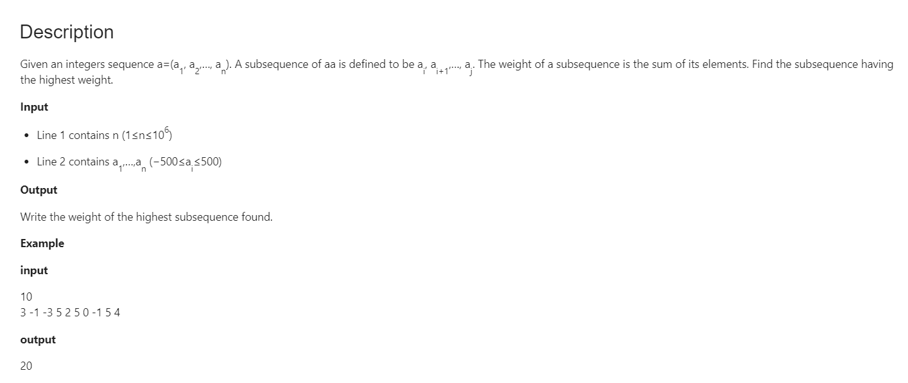
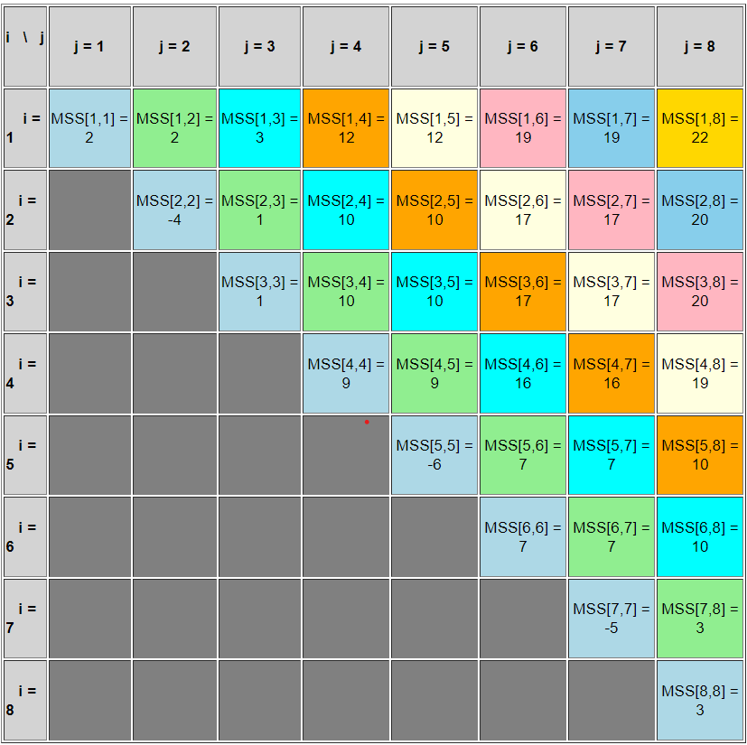
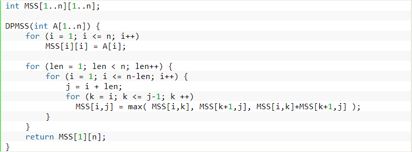

## Dynamic programming (bottom up I guess)
A[1..2] = {2, -4} --> MSS[1,2] = max{MSS[1,1], MSS[2,2], MSS[1,1]+MSS[2,2]} = max{2,-4,-2} = 2

A[2..3] = {-4, 1} --> MSS[2,3] = max{MSS[2,2], MSS[3,3], MSS[2,2]+MSS[3,3]} = max{-4,1,-3} = 1

A[3..4] = {1, 9} --> MSS[3,4] = max{MSS[3,3], MSS[4,4], MSS[3,3]+MSS[4,4]} = max{1,9,10} = 10

A[4..5] = {9, -6} --> MSS[4,5] = max{MSS[4,4], MSS[5,5], MSS[4,4]+MSS[5,5]} = max{9,-6,3} = 9

A[5..6] = {-6, 7} --> MSS[5,6] = max{MSS[5,5], MSS[6,6], MSS[5,5]+MSS[6,6]} = max{-6,7,1} = 7

A[6..7] = {7, -5} --> MSS[6,7] = max{MSS[6,6], MSS[7,7], MSS[6,6]+MSS[7,7]} = max{7,-5,2} = 7

A[7..8] = {-5, 3} --> MSS[7,8] = max{MSS[7,7], MSS[8,8], MSS[7,7]+MSS[8,8]} = max{-5,3,-2} = 3


## Example


## Example 2
```cpp
/* Dynamic Programming implementation 
of Maximum Sum Increasing Subsequence 
(MSIS) problem */
#include <bits/stdc++.h> 
using namespace std; 

/* maxSumIS() returns the maximum 
sum of increasing subsequence 
in arr[] of size n */
int maxSumIS(int arr[], int n) 
{ 
	int i, j, max = 0; 
	int msis[n]; 

	/* Initialize msis values 
	for all indexes */
	for ( i = 0; i < n; i++ ) 
		msis[i] = arr[i]; 

	/* Compute maximum sum values 
	in bottom up manner */
	for ( i = 1; i < n; i++ ) 
		for ( j = 0; j < i; j++ ) 
			if (arr[i] > arr[j] && 
				msis[i] < msis[j] + arr[i]) 
				msis[i] = msis[j] + arr[i]; 

	/* Pick maximum of 
	all msis values */
	for ( i = 0; i < n; i++ ) 
		if ( max < msis[i] ) 
			max = msis[i]; 

	return max; 
} 

// Driver Code 
int main() 
{ 
	int arr[] = {1, 101, 2, 3, 100, 4, 5}; 
	int n = sizeof(arr)/sizeof(arr[0]); 
	cout << "Sum of maximum sum increasing "
			"subsequence is " << maxSumIS( arr, n ) << endl; 
	return 0; 
} 

// This is code is contributed by rathbhupendra 
```