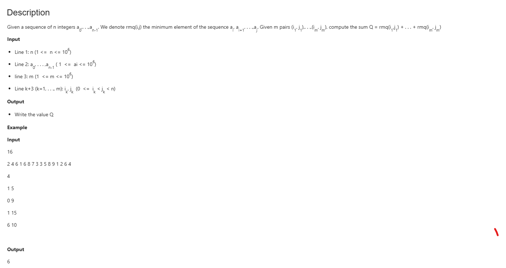

# EXAMPLE RMQ
```c++
// C++ program to do range 
// minimum query in O(1) time with
// O(n*n) extra space and O(n*n) 
// preprocessing time.
#include <bits/stdc++.h>
using namespace std;
#define MAX 500

// lookup[i][j] is going to store 
// index of minimum value in
// arr[i..j]
int lookup[MAX][MAX];

// Structure to represent a query range
struct Query {
	int L, R;
};

// Fills lookup array lookup[n][n] 
// for all possible values
// of query ranges
void preprocess(int arr[], int n)
{
	// Initialize lookup[][] for the 
	// intervals with length 1
	for (int i = 0; i < n; i++)
		lookup[i][i] = i;

	// Fill rest of the entries in bottom up manner
	for (int i = 0; i < n; i++) {
		for (int j = i + 1; j < n; j++)

			// To find minimum of [0,4],
			// we compare minimum
			// of arr[lookup[0][3]] with arr[4].
			if (arr[lookup[i][j - 1]] < arr[j])
				lookup[i][j] = lookup[i][j - 1];
			else
				lookup[i][j] = j;
	}
}

// Prints minimum of given m 
// query ranges in arr[0..n-1]
void RMQ(int arr[], int n, Query q[], int m)
{
	// Fill lookup table for 
	// all possible input queries
	preprocess(arr, n);

	// One by one compute sum of all queries
	for (int i = 0; i < m; i++) 
	{
		// Left and right boundaries 
		// of current range
		int L = q[i].L, R = q[i].R;

		// Print sum of current query range
		cout << "Minimum of [" << L 
			<< ", " << R << "] is "
			<< arr[lookup[L][R]] << endl;
	}
}

// Driver code
int main()
{
	int a[] = { 7, 2, 3, 0, 5, 10, 3, 12, 18 };
	int n = sizeof(a) / sizeof(a[0]);
	Query q[] = { { 0, 4 }, { 4, 7 }, { 7, 8 } };
	int m = sizeof(q) / sizeof(q[0]);
	RMQ(a, n, q, m);
	return 0;
}

```


```cpp
// C++ program to do range minimum
// query in O(1) time with
// O(n Log n) extra space and 
// O(n Log n) preprocessing time
#include <bits/stdc++.h>
using namespace std;
#define MAX 500

// lookup[i][j] is going to 
// store index of minimum value in
// arr[i..j]. Ideally lookup 
// table size should not be fixed
// and should be determined using 
// n Log n. It is kept
// constant to keep code simple.
int lookup[MAX][MAX];

// Structure to represent a query range
struct Query {
	int L, R;
};

// Fills lookup array 
// lookup[][] in bottom up manner.
void preprocess(int arr[], int n)
{
	// Initialize M for the 
	// intervals with length 1
	for (int i = 0; i < n; i++)
		lookup[i][0] = i;

	// Compute values from smaller 
	// to bigger intervals
	for (int j = 1; (1 << j) <= n; j++) 
	{
		// Compute minimum value for 
		// all intervals with size
		// 2^j
		for (int i = 0; (i + (1 << j) - 1) < n; i++) 
		{
			// For arr[2][10], we 
			// compare arr[lookup[0][3]]
			// and arr[lookup[3][3]]
			if (arr[lookup[i][j - 1]]
				< arr[lookup[i + (1 << (j - 1))][j - 1]])
				lookup[i][j] = lookup[i][j - 1];
			else
				lookup[i][j]
					= lookup[i + (1 << (j - 1))][j - 1];
		}
	}
}

// Returns minimum of arr[L..R]
int query(int arr[], int L, int R)
{
	// For [2,10], j = 3
	int j = (int)log2(R - L + 1);

	// For [2,10], we compare arr[lookup[0][3]] and
	// arr[lookup[3][3]],
	if (arr[lookup[L][j]]
		<= arr[lookup[R - (1 << j) + 1][j]])
		return arr[lookup[L][j]];

	else
		return arr[lookup[R - (1 << j) + 1][j]];
}

// Prints minimum of given 
// m query ranges in arr[0..n-1]
void RMQ(int arr[], int n, Query q[], int m)
{
	// Fills table lookup[n][Log n]
	preprocess(arr, n);

	// One by one compute sum of all queries
	for (int i = 0; i < m; i++) 
	{
		// Left and right boundaries 
		// of current range
		int L = q[i].L, R = q[i].R;

		// Print sum of current query range
		cout << "Minimum of [" << L << ", "
			<< R << "] is "
			<< query(arr, L, R) << endl;
	}
}

// Driver code
int main()
{
	int a[] = { 7, 2, 3, 0, 5, 10, 3, 12, 18 };
	int n = sizeof(a) / sizeof(a[0]);
	Query q[] = { { 0, 4 }, { 4, 7 }, { 7, 8 } };
	int m = sizeof(q) / sizeof(q[0]);
	RMQ(a, n, q, m);
	return 0;
}

```